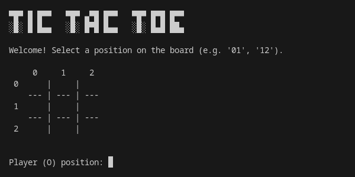

# Tic Tac Toe Game

A text-based version of the Tic Tac Toe game built with Python.



## Table of Contents

- [Introduction](#introduction)
- [Requirements](#requirements)
- [Installation](#installation)
- [Usage](#usage)
- [Contributing](#contributing)
- [License](#license)

## Introduction

This is a simple text-based implementation of the classic Tic Tac Toe game using Python. The game allows two players to play against each other on the command line interface.

## Requirements

To run this Tic Tac Toe game, you need to have the following installed:

- Python 3.x
- NumPy library

## Installation

1. Clone this repository to your local machine:

   ```bash
   git clone https://github.com/alexkanavos/tic-tac-toe.git
   ```

2. Navigate to the project directory:

   ```bash
   cd tic-tac-toe
   ```

3. Install the required dependencies using pip:

   ```bash
   pip install -r requirements.txt
   ```

## Usage

To start the game, run the following command:

```bash
python3 main.py
```

Follow the on-screen instructions to play the game. Players will take turns inputting their moves by specifying the row and column of their desired move. The game will display the current state of the board after each move and will declare the winner when appropriate.

## Contributing

Contributions are welcome! If you'd like to contribute to this project, please follow these steps:

1. Fork the repository
2. Create your feature branch (`git checkout -b feature/YourFeature`)
3. Commit your changes (`git commit -am 'Add some feature'`)
4. Push to the branch (`git push origin feature/YourFeature`)
5. Create a new Pull Request

Please make sure to update tests as appropriate.

## License

This project is licensed under the MIT License - see the [LICENSE](LICENSE) file for details.
